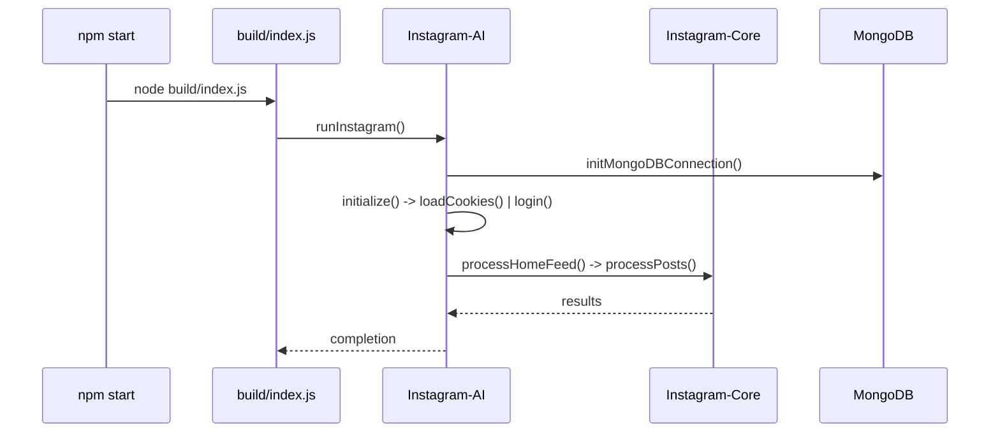

# Runtime and Entrypoints

This document explains exactly how the bot starts, which scripts are involved, and how control flows through the code at runtime.

## Primary Entrypoints

- "start" script in `package.json`
  - `npm start`
  - Expands to: `tsc && node build/index.js`
  - Compiles TypeScript to `build/` and runs `build/index.js`.

- `build/index.js` and `src/index.ts`
  - `build/index.js` is compiled from `src/index.ts`.
  - Loads `.env` via `dotenv`, logs the expected path, then calls `runInstagram()` from `build/client/Instagram-AI.js`.
  - File references:
    - `src/index.ts`
    - `build/index.js`

- `runInstagram()` in `src/client/Instagram-AI.ts`
  - Validates credentials from `.env`.
  - Calls `initMongoDBConnection()`.
  - Calls `startInteractionLoop(username)`.

- `startInteractionLoop()` in `src/client/Instagram-AI.ts`
  - Creates an `InstagramAI` instance.
  - `initialize()` launches the browser, creates a page, applies default timeouts, and calls `loadCookies()`.
  - Then drives the interaction loop using `processHomeFeed()` and `processPosts()` from `Instagram-Core`.

## Control Flow at Runtime

1. `npm start` → `build/index.js` → `runInstagram()`
2. `runInstagram()` → `initMongoDBConnection()` → `startInteractionLoop()`
3. `initialize()`
   - Launch Puppeteer with stealth plugin and visible browser
   - Create a page and apply defaults (`setDefaultTimeout`, `setDefaultNavigationTimeout`)
   - `loadCookies()`
     - If `cookies.json` exists (root of project), set cookies and attempt to open Instagram home
     - If cookies are invalid or missing, `login()` is performed
4. After login, cookies are saved back to `cookies.json` for reuse
5. `processHomeFeed()` loads posts, `processPosts()` handles like/comment logic

## Where Cookies Are Read/Written

- Path: `process.cwd()/cookies.json` (i.e., `Riona-AI-Agent-main/cookies.json`)
- Implemented in `src/client/Instagram-AI.ts` (`loadCookies()` and `login()`)
- Additional cookie files may exist in `cookies/` for different accounts; only `cookies.json` at the root is read on startup by `Instagram-AI`.

## Timeouts and Slower Networks

- Configurable via `.env` → `INSTAGRAM_TIMEOUT_MS` (milliseconds)
- Applied to key operations:
  - `page.goto()` for login and validation
  - `page.waitForSelector()` for username/password fields and feeds
  - `page.waitForNavigation()` after login
- You can override per run in PowerShell: `$env:INSTAGRAM_TIMEOUT_MS="600000"` (10 minutes) before starting.

## Scripts that Start the App

- `start-instagram-bot.bat`
  - Ensures dependencies exist, runs `npx tsc`, then `npm run start` (same as above).

- `run-instagram.ps1`
  - Loads `.env` manually, allows toggling proxy flags, then runs `npx ts-node src/index.ts`.
  - Useful for development and quick login tests without building to `build/`.

- `start-agent.ps1`
  - Installs `pm2` if missing, runs `tsc`, then `pm2 start ecosystem.config.js` and `pm2 save`.
  - Use this for 24/7 operation.

- `ecosystem.config.js` (PM2)
  - Defines app `instagram-scheduler` with script `./build/index.js`.
  - Loads environment from `.env` at start.

- `setup-scheduler.ps1` (Windows Task Scheduler)
  - Registers a Windows scheduled task named "Instagram Bot" to run `start-instagram-bot.bat` every 45 minutes for up to 5 minutes.
  - Good for periodic one-shot runs.

## Dist vs Build

- `build/` is the TypeScript compile target used by the current runtime path (`npm start`, PM2, batch).
- `dist/` contains older or alternative build outputs used by some debug/test scripts; main runtime uses `build/`.

## Logging

- Centralized logger: `src/config/logger.ts` (compiled to `build/config/logger.js`)
- Logs go to the `logs/` directory and are also referenced in the readme and monitoring docs.

## High-Level Sequence Diagram

